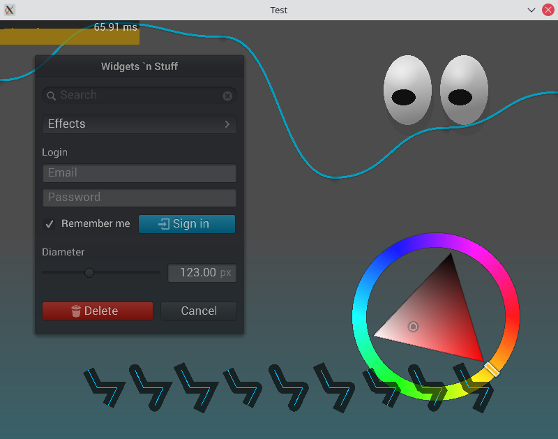

NanoVG-hs
==================================

NanoVG-hs is small vector graphics rendering library for OpenGL. Its API is modeled after the HTML5 canvas API. It is a Hakell binding to the corresponding [NanoVG](https://github.com/memononen/nanovg) library.

Here is a replication of the demo of the orginal library



## Features

   - Many geometric primitives: rectangles, arcs, ellipses, rounded rectangles
   - Fill or stroke
   - Gradients and patterns
   - Image
   - Basic text display: font metrics, multi-line text

## Hello World example

 1. Set up an OpenGL context. For instance, using [OpenGLRaw](https://hackage.haskell.org/package/OpenGLRaw) and [sdl2](https://hackage.haskell.org/package/sdl2): 

```haskell
import Linear.V2         -- linear package
import Graphics.GL       -- OpenGLRaw package
import Graphics.NanoVG   -- NanoVG-hs package
import qualified SDL     -- sdl2 pacakge

import
main :: IO ()
main = do
    SDL.initialize [SDL.InitVideo]

    let windowSize = V2 1000 600
    let windowResolution = WindowResolution (realToFrac <$> windowSize) 4.0
    window <- SDL.createWindow "Test" $ SDL.defaultWindow {
        SDL.windowInitialSize     = windowSize,
        SDL.windowGraphicsContext = SDL.OpenGLContext $ SDL.defaultOpenGL {SDL.glProfile = SDL.Core SDL.Normal 3 3}
    }
    
    context <- SDL.glCreateContext window
    -- glewInit -- you may need to initialize GLEW depending on your platform

    nvgContext <- nvgGL3Context [Debug]
    glClearColor 0.3 0.3 0.3 1

    let app = do
    	glClear GL_COLOR_BUFFER_BIT
    	frame nvgContext windowResolution renderDemo -- render is where the drawing is done!
        
    	SDL.glSwapWindow window

        events <- SDL.pollEvents
        unless (any qui) $ app

    app
    SDL.destroyWindow window
    SDL.quit
```

 2. Display a rounded rectangle using drawing primitives

```haskell
renderDemo :: VG ()
renderDemo = do
	withPath Open $ do
		roundedRect
			(V2 20 30)
			(V2 40 50)
			5
	strokeColor $ fromRGB 127 25 0
	stroke 
```